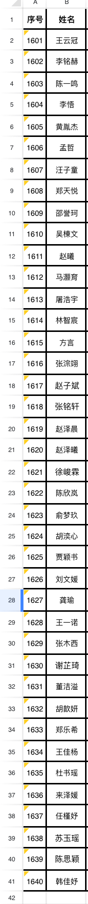

## 一年级课表
| 节次       | 时间        | 周一     | 周二     | 周三     | 周四     | 周五       |
| ---------- | ----------- | -------- | -------- | -------- | -------- | ---------- |
| 值日早读   | 7:50~8:10   | 值日早读 | 值日早读 | 值日早读 | 值日早读 | 值日早读   |
| 第一节     | 8:20~9:00   | 数学     | 语文     | 数学     | 语文     | 数学       |
| 大课间活动 | 9:00~9:40   | 课间活动 | 课间活动 | 课间活动 | 课间活动 | 课间活动   |
| 第二节     | 9:50~10:30  | 语文     | 语文     | 音乐     | 数学     | 语文       |
| 第三节     | 10:40~11:25 | 道法     | 地方校本 | 语文     | 语文     | 语文(书法) |
| 午 餐      | 11:25~12:00 | 午 餐    | 午 餐    | 午 餐    | 午 餐    | 午 餐      |
| 午 睡      | 12:00~13:00 | 午 睡    | 午 睡    | 午 睡    | 午 睡    | 午 睡      |
| 第四节     | 13:10~13:50 | 科学     | 美术     | 体育3    | 音乐     | 道法       |
| 第五节     | 14:00~14:45 | 体育2    | 劳动     | 美术     | 体育1    | 体育2      |
| 课间活动   | 14:45~15:00 | 课间活动 | 课间活动 | 课间活动 | 课间活动 | 课间活动   |
| 第六节     | 15:00~15:40 | 基础托管 | 基础托管 | 班队心里 | 基础托管 | 基础托管   |
| 拓展托管   | 15:50~16:30 | 拓展托管 | 足球     | 拓展托管 | 足球     | 拓展托管   |

| 节次       | 时间        | 周一     | 周二       | 周三       | 周四       | 周五         |
|------------|-------------|----------|------------|------------|------------|--------------|
| 值日早读   | 07:50-08:10 | 值日早读 | 值日早读   | 值日早读   | 值日早读   | 值日早读     |
| 第一节     | 08:20-09:00 | 数学     | 语文       | 数学       | 语文       | 数学         |
| **大课间** | 09:00-09:40 | 活动时间 | 活动时间   | 活动时间   | 活动时间   | 活动时间     |
| 第二节     | 09:50-10:30 | 语文     | 语文       | 音乐       | 数学       | 语文         |
| 第三节     | 10:40-11:25 | 道法     | 地方校本   | 语文       | 语文       | 语文（书法） |
| **午休时段**                                                                                |
| 午餐       | 11:25-12:00 | 统一午餐 | 统一午餐   | 统一午餐   | 统一午餐   | 统一午餐     |
| 午睡       | 12:00-13:00 | 午休时间 | 午休时间   | 午休时间   | 午休时间   | 午休时间     |
| **下午课程**                                                                                |
| 第四节     | 13:10-13:50 | 科学     | 美术       | 体育3      | 音乐       | 道法         |
| 第五节     | 14:00-14:45 | 体育2    | 劳动教育   | 美术       | 体育1      | 体育2        |
| 课间活动   | 14:45-15:00 | 自由活动 | 自由活动   | 自由活动   | 自由活动   | 自由活动     |
| **托管时段**                                                                                |
| 基础托管   | 15:00-15:40 | 学业辅导 | 学业辅导   | 班队心理   | 学业辅导   | 学业辅导     |
| 拓展托管   | 15:50-16:30 | 兴趣班   | 足球训练   | 兴趣班     | 足球训练   | 兴趣班       |

## 一年级值日

## 学号

### **极简积分系统升级版**

#### **一、每日积分规则**（白板记录）
**基础任务**（每项1★）：
1. ✅ 英语（25分钟）
2. ✅ 阅读（15分钟）
3. ✅ 口算
4. ✅ 语文/数学作业（工整完成）

**基础家务**（每项1★，每日限3项）：
1. 🧺 餐前摆碗筷盛饭（3人份）
2. 📚 整理书包/书桌
3. 🗑️ 丢垃圾

**惊喜加分**（用⭐️标记）：
- 🚀 不磨蹭 +1★
- 🍚 晚饭前完成指定三项作业 +1★
- ✍️ 坐姿端正 +1★
- 🧠 完成学霸练习（额外挑战题） +2★
- 👩🏫 获得老师表扬（出示奖状/消息） +5★
- 💯 练习满分 +15★
---

#### **二、积分兑换**
**即时兑换**：
- 20★ = 游戏时长20分钟
- 20★ = 一集动画片
- 20★ = 盲盒

**周末大奖**：
- 40★ = 自选电影+自选零食
- 40★ = 游乐场
- 40★ = 自选大餐

