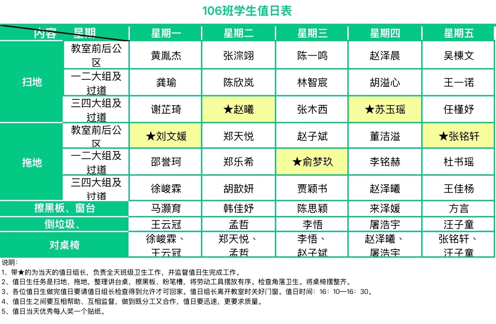

## 一年级课表
| 节次       | 时间        | 周一     | 周二     | 周三     | 周四     | 周五       |
| ---------- | ----------- | -------- | -------- | -------- | -------- | ---------- |
| 值日早读   | 7:50~8:10   | 值日早读 | 值日早读 | 值日早读 | 值日早读 | 值日早读   |
| 第一节     | 8:20~9:00   | 数学     | 语文     | 数学     | 语文     | 数学       |
| 大课间活动 | 9:00~9:40   | 课间活动 | 课间活动 | 课间活动 | 课间活动 | 课间活动   |
| 第二节     | 9:50~10:30  | 语文     | 语文     | 音乐     | 数学     | 语文       |
| 第三节     | 10:40~11:25 | 道法     | 地方校本 | 语文     | 语文     | 语文(书法) |
| 午 餐      | 11:25~12:00 | 午 餐    | 午 餐    | 午 餐    | 午 餐    | 午 餐      |
| 午 睡      | 12:00~13:00 | 午 睡    | 午 睡    | 午 睡    | 午 睡    | 午 睡      |
| 第四节     | 13:10~13:50 | 科学     | 美术     | 体育3    | 音乐     | 道法       |
| 第五节     | 14:00~14:45 | 体育2    | 劳动     | 美术     | 体育1    | 体育2      |
| 课间活动   | 14:45~15:00 | 课间活动 | 课间活动 | 课间活动 | 课间活动 | 课间活动   |
| 第六节     | 15:00~15:40 | 基础托管 | 基础托管 | 班队心里 | 基础托管 | 基础托管   |
| 拓展托管   | 15:50~16:30 | 拓展托管 | 足球     | 拓展托管 | 足球     | 拓展托管   |

## 一年级值日

## 学号
