## 语文

### 天地人

<audio controls="" src="../audio/天地人.mp3"></audio>

### 金木水火土

<audio controls="" src="../audio/金木水火土.mp3"></audio>

词语2：

<audio controls="" src="../audio/金木水火土2.mp3"></audio>

[字帖](../zitie/一二三上.pdf)

### 口耳目手足

<audio controls="" src="../audio/口耳目手足.mp3"></audio>

词语2：

<audio controls="" src="../audio/口耳目手足2.mp3"></audio>

[字帖](../zitie/口耳目手.pdf)

### 日月山川

<audio controls="" src="../audio/日月山川.mp3"></audio>

词语2：

<audio controls="" src="../audio/日月山川2.mp3"></audio>

[字帖](../zitie/日火田禾.pdf)

### 语文园地一
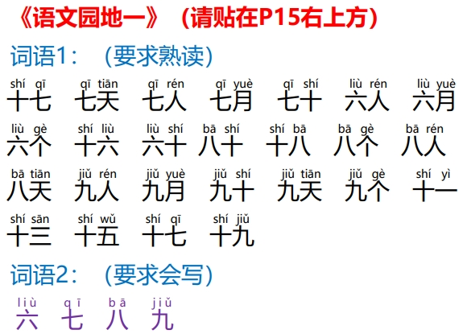

<audio controls="" src="../audio/语文园地一.mp3"></audio>

词语2：

<audio controls="" src="../audio/语文园地一2.mp3"></audio>

[字帖](../zitie/六七八九.pdf)

### 拼音bpmfdtnl
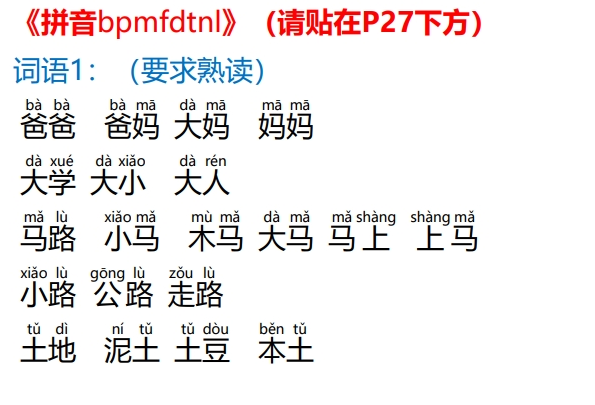

<audio controls="" src="../audio/拼音bpmfdtnl.mp3"></audio>

### 语文园地二
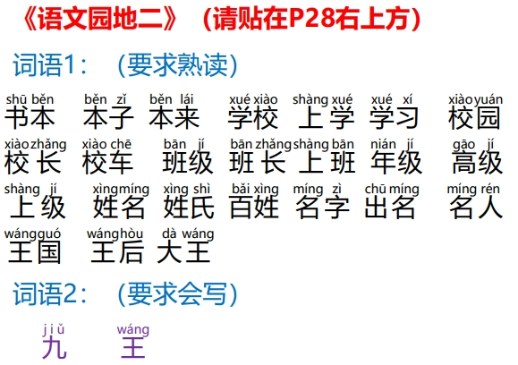

<audio controls="" src="../audio/语文园地二.mp3"></audio>

词语2：

<audio controls="" src="../audio/语文园地二2.mp3"></audio>

[字帖](../zitie/九王.pdf)

### 拼音gkhjqx

<audio controls="" src="../audio/拼音gkhjqx.mp3"></audio>

### 拼音zcsyw
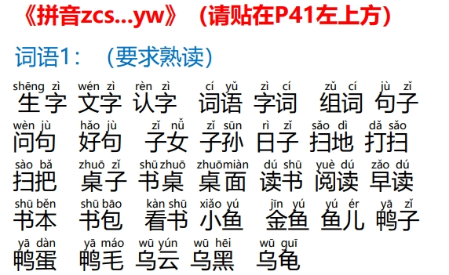

<audio controls="" src="../audio/拼音zcs.mp3"></audio>

### 语文园地三
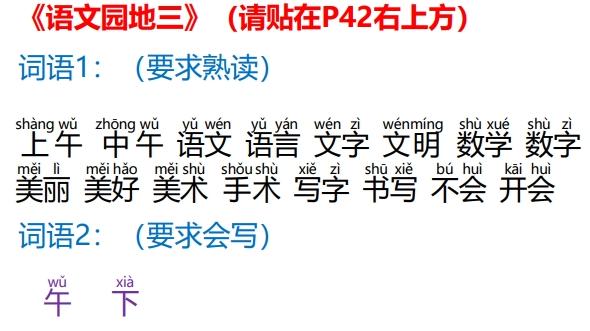

<audio controls="" src="../audio/语文园地三.mp3"></audio>

词语2：

<audio controls="" src="../audio/语文园地三2.mp3"></audio>

[字帖](../zitie/午下.pdf)

### 拼音aieiouiu
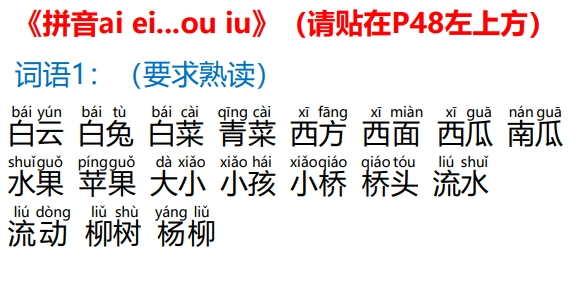

<audio controls="" src="../audio/拼音aiei.mp3"></audio>

### 拼音ieingong
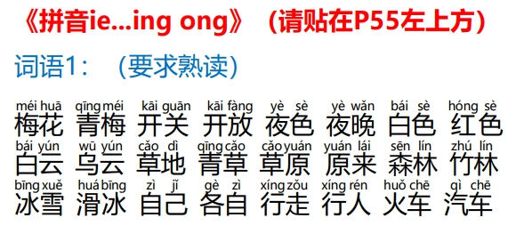

<audio controls="" src="../audio/拼音ie.mp3"></audio>

### 语文园地四

<audio controls="" src="../audio/语文园地四.mp3"></audio>

词语2：

<audio controls="" src="../audio/语文园地四2.mp3"></audio>

[字帖](../zitie/去年.pdf)

### 秋天

<audio controls="" src="../audio/秋天.mp3"></audio>

词语2：

<audio controls="" src="../audio/秋天2.mp3"></audio>

[字帖](../zitie/走了大人儿子二人.pdf)

### 江南

<audio controls="" src="../audio/江南.mp3"></audio>

词语2：

<audio controls="" src="../audio/江南2.mp3"></audio>

[字帖](../zitie/可以可乐东西东方叶子西方.pdf)

### 雪地里的小画家
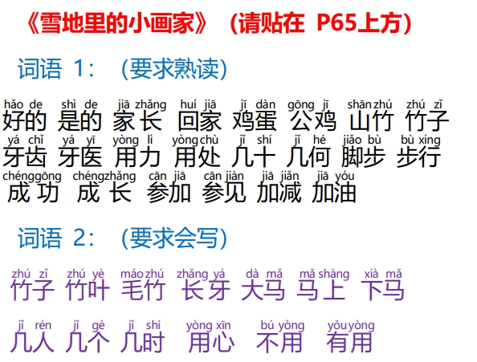

<audio controls="" src="../audio/雪地里的小画家.mp3"></audio>

词语2：

<audio controls="" src="../audio/雪地里的小画家2.mp3"></audio>

[字帖](../zitie/竹子竹叶毛竹长牙大马马上下马.pdf)

### 四季

<audio controls="" src="../audio/四季.mp3"></audio>

词语2：

<audio controls="" src="../audio/四季2.mp3"></audio>

[字帖](../zitie/四月四天小孩小雨不是是非天地天空.pdf)

### 语文园地五

<audio controls="" src="../audio/语文园地五.mp3"></audio>

词语2：

<audio controls="" src="../audio/语文园地五2.mp3"></audio>

[字帖](../zitie/女关开先.pdf)

### 对韵歌
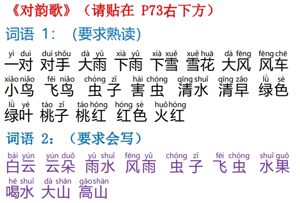

<audio controls="" src="../audio/对韵歌.mp3"></audio>

词语2：

<audio controls="" src="../audio/对韵歌2.mp3"></audio>

[字帖](../zitie/白云云朵雨水风雨虫子飞虫水果喝水大山高山.pdf)

### 日月明
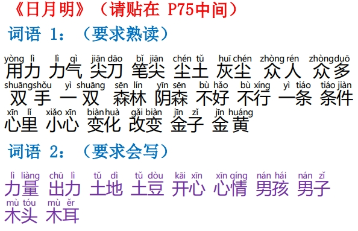

<audio controls="" src="../audio/日月明.mp3"></audio>

词语2：

<audio controls="" src="../audio/日月明2.mp3"></audio>

[字帖](../zitie/力量出力土地土豆开心心情男孩男子木头木耳.pdf)

### 小书包

<audio controls="" src="../audio/小书包.mp3"></audio>

词语2：

<audio controls="" src="../audio/小书包2.mp3"></audio>

[字帖](../zitie/尺寸木尺本子课本刀子大刀本子课本不好不吃少数很少.pdf)

### 升国旗

<audio controls="" src="../audio/升国旗.mp3"></audio>

词语2：

<audio controls="" src="../audio/升国旗2.mp3"></audio>

[字帖](../zitie/中间心中春风大风正好立正五个五月站立立冬.pdf)

### 语文园地六

<audio controls="" src="../audio/语文园地六.mp3"></audio>

词语2：

<audio controls="" src="../audio/语文园地六2.mp3"></audio>

[字帖](../zitie/牛羊果白.pdf)

### 小小的船
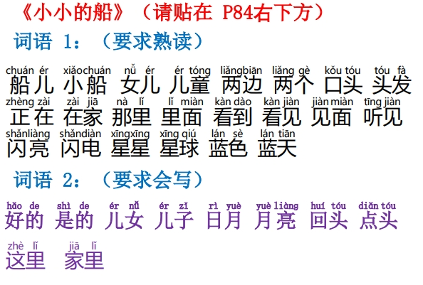

<audio controls="" src="../audio/小小的船.mp3"></audio>

词语2：

<audio controls="" src="../audio/小小的船2.mp3"></audio>

[字帖](../zitie/好的是的儿女儿子日月月亮回头点头这里家里.pdf)

### 影子

<audio controls="" src="../audio/影子.mp3"></audio>

词语2：

<audio controls="" src="../audio/影子2.mp3"></audio>

[字帖](../zitie/现在在家左面左右不好好心.pdf)

### 两件宝
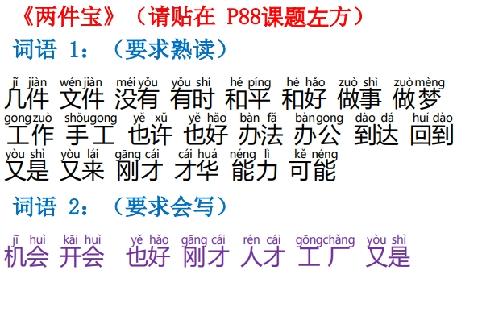

<audio controls="" src="../audio/两件宝.mp3"></audio>

词语2：

<audio controls="" src="../audio/两件宝2.mp3"></audio>

[字帖](../zitie/机会开会也好刚才人才工厂又是.pdf)

### 语文园地七

<audio controls="" src="../audio/语文园地七.mp3"></audio>

词语2：

<audio controls="" src="../audio/语文园地七2.mp3"></audio>

[字帖](../zitie/爸爸阿爸妈妈姑妈.pdf)

### 比尾巴
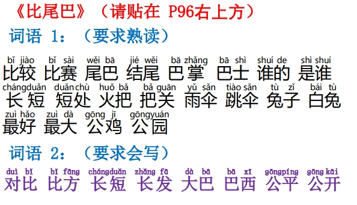

<audio controls="" src="../audio/比尾巴.mp3"></audio>

词语2：

<audio controls="" src="../audio/比尾巴2.mp3"></audio>

[字帖](../zitie/对比比方长短长发大巴巴西公平公开.pdf)

### 乌鸦喝水

<audio controls="" src="../audio/乌鸦喝水.mp3"></audio>

词语2：

<audio controls="" src="../audio/乌鸦喝水2.mp3"></audio>

[字帖](../zitie/一只只有个子出去日出看见见面石头.pdf)

### 雨点儿

<audio controls="" src="../audio/雨点儿.mp3"></audio>

词语2：

<audio controls="" src="../audio/雨点儿2.mp3"></audio>

[字帖](../zitie/从小从来半天半空回来来去你好你们没有有时.pdf)

### 语文园地八

<audio controls="" src="../audio/语文园地八.mp3"></audio>

词语2：

<audio controls="" src="../audio/语文园地八2.mp3"></audio>

[字帖](../zitie/厂长厂家生日生命.pdf)
